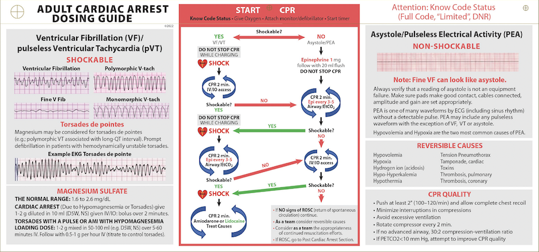
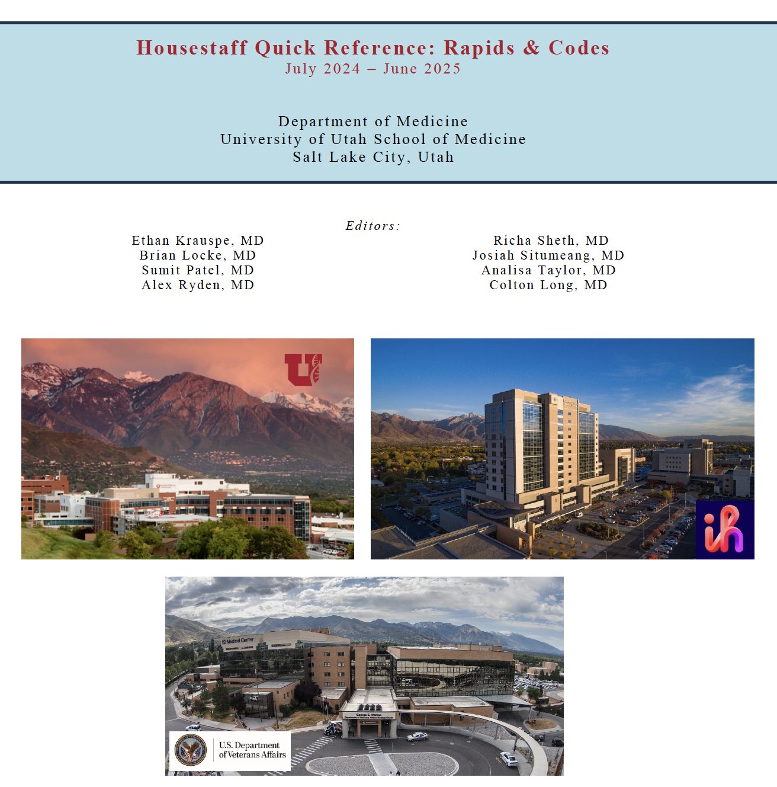

Quick reference materials for Code Blue and Rapid Response leadership.

## Key Points

- **Name the leadership state early.** Ask who is coordinating, then lead, support, consult, or transition leadership explicitly.
- **Get the nursing trajectory.** Ask bedside and outreach nurses what changed, what has been tried, and what worries them most.
- **Protect pulse checks.** Prepare the pause, make shock/no-shock and pulse/no-pulse decisions public, and resume compressions quickly when uncertain.
- **Plan the next step explicitly.** Use bedside and outreach expertise to identify the key decision, needed resource, destination, and trigger.
- **Close the loop before leaving.** Name disposition, follow-up owner, callback person, and the trigger for calling RRT, ICU, or code response.

## ACLS Card

{fig-alt="Adult cardiac arrest dosing guide and rhythm decision card"}

## Site Differences

|  | **U of U** | **IMED** | **VA** |
|:---|:---|:---|:---|
| **RRT/MET** | House Sup, IM Res, SICU RN, Pharm | IM, CICU RN, Nurse Sup, Pharm, RT, EKG, ABG, Lab | IM, MICU, CNO, RNs, RT, Pharmacy (7a-7p) |
| **Code Blue** | **add:** Anesthesia, EMT, MICU resident, Pharm, ICU Fellow | **add:** ICU attendings | **add:** Anesthesia/ED |
| **Numbers** | **Shock Team, Cath, Brain Attack, VAD:** 1-2222 | **Shock Team:** Vocera TICU attending; **Brain Attack:** Operator/x33333 | **Brain Attack:** Page Neuro Senior; **Cath:** Page Cardiology; **Code:** x6666 |

## Rapid Response Guide

[{fig-alt="Housestaff quick reference for rapid responses and codes" width="500"}](assets/manuals/RRTCodeManual.051425.pdf)

[Open the RRT/Code guide PDF](assets/manuals/RRTCodeManual.051425.pdf)

[{fig-alt="QR code for the RRT and Code manual" width="250"}](assets/manuals/RRTCodeManual.051425.pdf)
