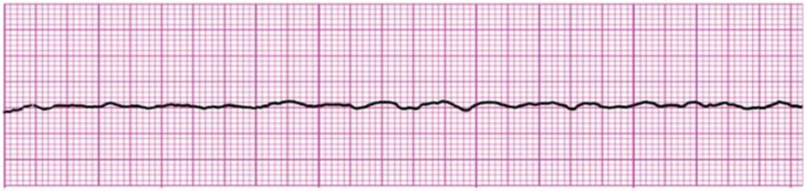
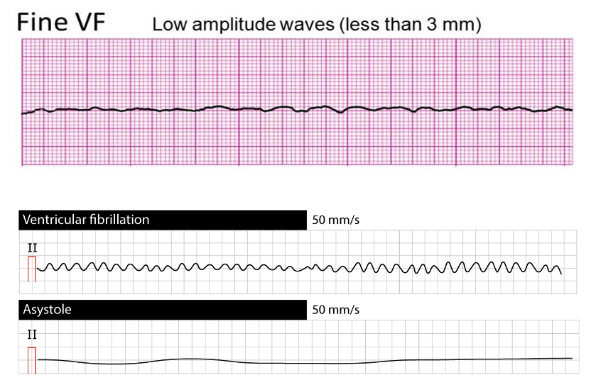

## Case 1

70M with ESRD found unresponsive on the floor.

No pulse.

CPR in progress, IV Access Obtained

## Labs

- Acid-base: pH 6.98, HCO₃⁻ 12, pCO₂ 55.
- Hyperkalemia signal: K⁺ 7.2, iCa²⁺ 0.98.
- Context: lactate 9.2, hs-TnI 11k, glucose 98.

## Rhythm: 

## Analysis:

{fig-alt="Fine VF vs Coarse VF vs Asystole" width="1200"}

## Team interface prompt

The bedside nurse is recording events and knows the first rhythm seen on the monitor.

Ask:

> "First rhythm? CPR start time? Next pulse check?"

Assign: timekeeper, compressor switch, defib, meds/pharm.

## Teaching Points

-   No shock for asystole.

<!-- -->

-   But, always confirm not fine VF

    -   Enroll your colleagues help

    -   If unsure, make the less bad error.

-   Calcium, bicarbonate, and insulin-glucose are cause-directed treatments for suspected hyperkalemia. They are not routine arrest medications.

## Case summary

**Label:** Metabolic derangements / ESRD - asystole versus fine VF.

**Key issue:** confirm true asystole versus fine VF; hyperkalemia treatments are cause-directed, not routine arrest medications.

[Return to Course Page](../ "Course Page")
