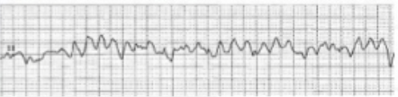
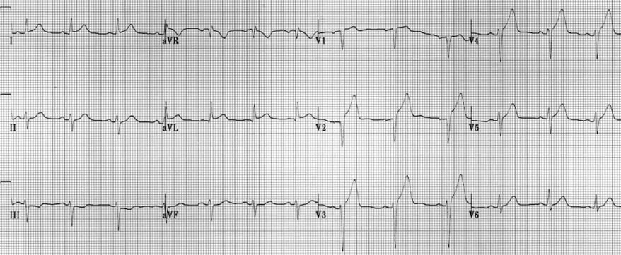

## Case 2

58F with history of CAD s/p multiple remote DES, HLD, T2DM, Active smoker now admitted for UTI with sepsis.

Telemetry alarms "code blue" on hospital day 2.

On initial assessment, pulses are absent.

## Labs

- Acid-base: pH 7.18, HCO₃⁻ 16, pCO₂ 48.
- Perfusion/electrolytes: lactate 6.5, K⁺ 4.9, iCa²⁺ 1.10.
- Context: glucose 152, hs-TnI 121 *(ULN 50)*.

## Rhythm Check

## Post-ROSC EKG

{fig-alt="Post-ROSC EKG" fig-align="center" width="1200"}

## After ROSC: stabilize before you celebrate

- ECG as soon as feasible.
- O2 100% until reliable; then SpO2 90-98%.
- PaCO2 35-45 if comatose/ventilated.
- Avoid hypotension; MAP >=65.
- If unresponsive: temperature control >=36 hours.
- Search cause: coronary, PE, tamponade, hemorrhage, PTX, tox/metabolic.

## Team interface prompt

The nurse who called the code saw the telemetry alarm and knows when the patient lost pulses.

Ask:

> "What rhythm triggered the alarm, when did compressions start, and has the first shock happened?"

Close the loop on shock timing and post-ROSC ECG.

## Teaching Points

-   Time to first shock is critical in VF

-   Role of antiarrhythmics is adjunctive, not primary

-   Persisting VF/pVT: follow device energy strategy; if unsure, maximum biphasic energy is reasonable. Protect compression fraction and confirm pads/contact. Do not teach routine DSED/vector-change as standard care.

-   VF/VT: Think.. **acute MI (**sudden, **chest pain)**, **electrolyte derangements**, **drug toxicity**

## Case summary

**Label:** VF/VT arrest with post-ROSC ECG and stabilization.

**Key issue:** shock early, protect compression fraction, then stabilize and search for the post-ROSC cause.

[Return to Course Page](../ "Course Page")
