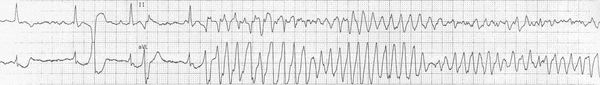
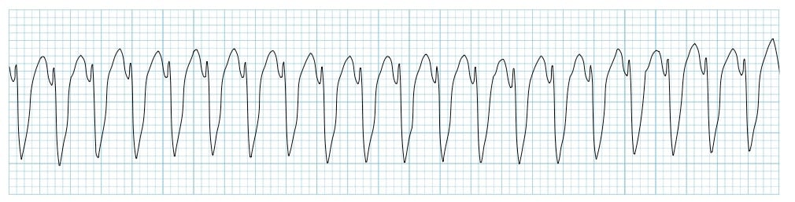

## Case 3

24F with receiving antipsychotics and anti-emetics collapses on telemetry and is pulseless. 

{alt="Polymorphic VT w Long QT = TdP" width="1000"}

## EKG analysis

{alt="Polymorphic VT w Long QT = TdP" width="1000"}

[Excellent Life in the Fast Lane Summary](https://litfl.com/polymorphic-vt-and-torsades-de-pointes-tdp/ "Link with more info")

## EKG analysis

{width="500"}

## EKG analysis

{width="500"}

## Team interface prompt

The medication history matters.

Ask nursing/pharmacy:

> "What QT-prolonging medications has she received, and when was the last dose?"

Then say the rhythm plan out loud.

## Learning Points

-   Sustained polymorphic VT is unstable: shock immediately with unsynchronized high-energy defibrillation because synchronization may fail. If recurrent TdP with long QT, give magnesium, address bradycardia/QT drivers, and ask for expert help for overdrive pacing or isoproterenol.

-   QT prolongation more dangerous with slow HR

## Case summary

**Label:** Polymorphic VT/TdP after QT-prolonging medications.

**Key issue:** sustained polymorphic VT needs immediate unsynchronized shock; recurrent long-QT/TdP needs magnesium, QT-driver correction, and expert help.

[Return to Course Page](../ "Course Page")
