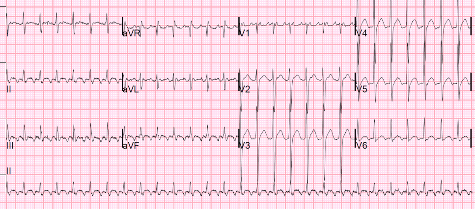
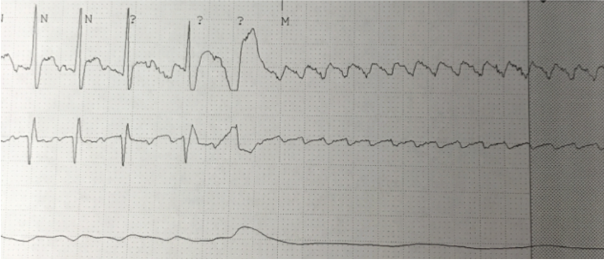
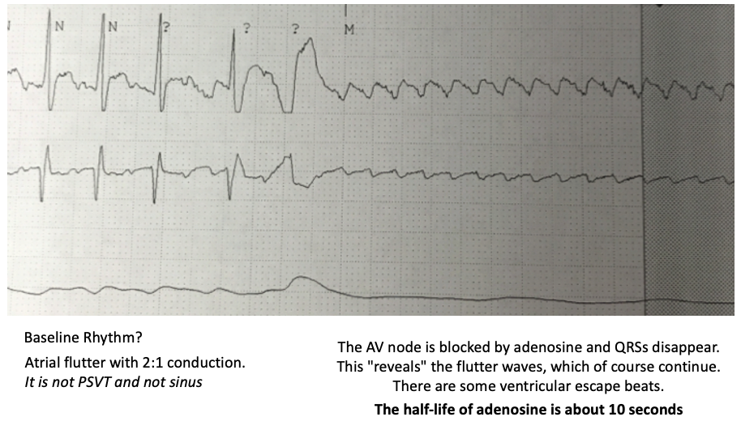

## Case 4

36F admitted for ETOH detox.

RRT activated on third day of admission.

Tachycardic, HR 180s, dizzy/lightheaded but responsive, pulsatile in all ext. 

## Team interface prompt

The outreach nurse arrived before you and has already tried vagal maneuvers.

Start with:

> "Can I get the 30-second story: what changed, what have you tried, and what are you worried about?"

Then state whether this is stable, unstable, or peri-arrest.

## EKG

{width="1200"}

## Peri-Adenosine EKG:

## Analysis:

{width="1200"}

[Return to Course Page](../ "Course Page")
