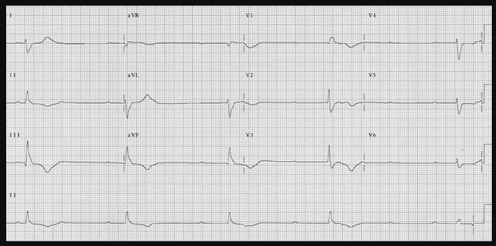
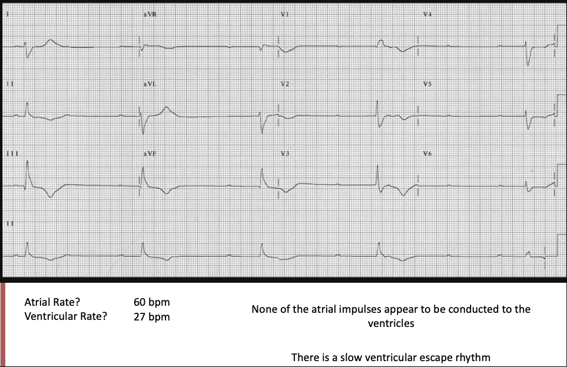

## Case 5

82F with bradycardia, confusion, SBP 80s.

RRT activated for bradycardia 

## EKG:

{width="1200"}

## Team interface prompt

The bedside nurse can help prepare pacing before the patient loses pulses.

Ask:

> "Are pads on? Who can help with sedation? Who is calling cardiology/ICU?"

Do not wait until arrest to organize the room.

## EKG Analysis

{width="1200"}

## Teaching Points: 

-   Complete heart block = AV dissociation.
-   Atropine ineffective in infranodal blocks.
-   Always have pacing pads in place during rapid responses.
    -   Transcutaneous pacing will require sedation

[Return to Course Page](../ "Course Page")
