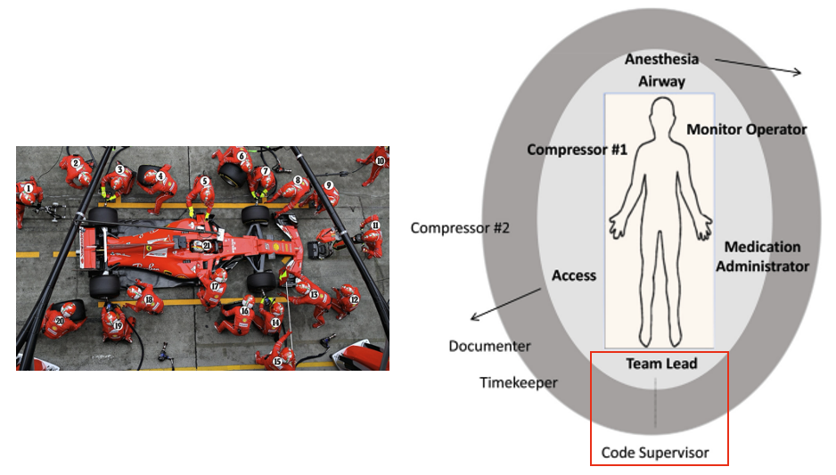
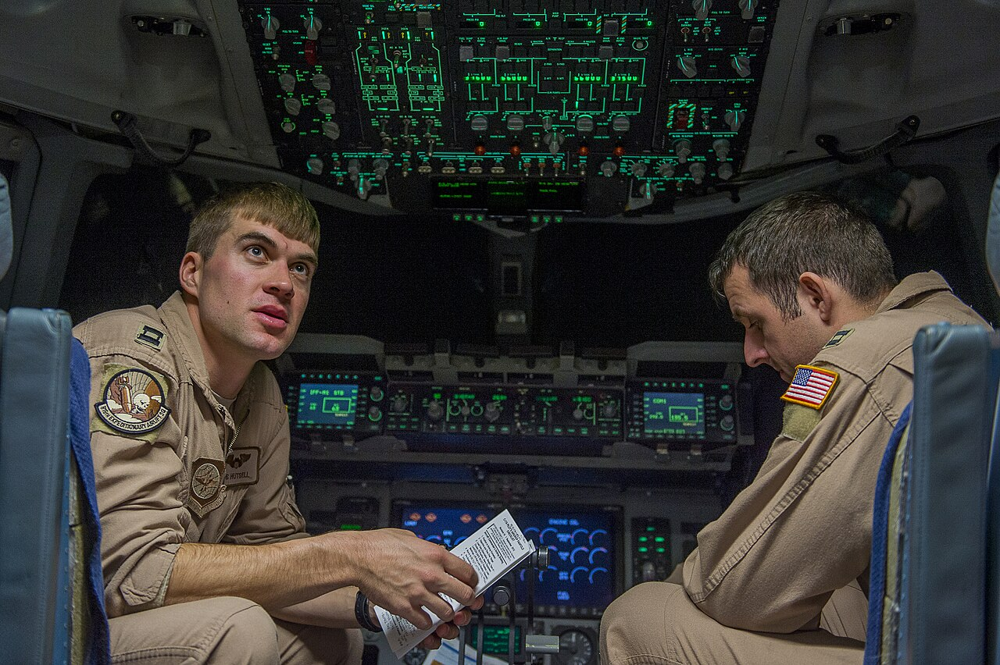

## Leadership

### Learners will practice:

1. Naming who is leading
2. Stay at the foot of the bed
3. Think out loud
4. Flat hierarchy

## Case start

### Rapid response to S408

Sign-out: "81M, SVT, now stable."

Now: HR 160, MAP 85 -> 70, lightheaded.

A bedside nurse says: "He looks worse."

**Prompt:** How do you begin leading this rapid?

## Say the sentence

Try:

> "I'm [name], the senior medicine resident responding to the rapid. Who is currently coordinating this response?"

Paths you might take depending on the response:

> "Okay, I'll run the room."

> "Can I take over?"

> "Okay, how can I help?"

## Failure modes

Ways this commonly goes wrong:

- It is not clear what each person's role is.
- Power dynamics make someone else the de facto leader.
- Handoff in roles has not occurred.
- Everyone assumes someone else is leading.

Who leads is less important than that **someone** leads.

## Stay at the foot of the bed

:::: columns
::: {.column width="46%"}
If you are leading:

- Stay at the foot of the bed.
- Keep the patient and monitor in view.
- Stay visible and findable.
- Delegate instead of becoming the task person.
:::

::: {.column width="54%"}
<figure style="margin: 0;">
  
  <figcaption style="font-size: 0.68em; line-height: 1.1; margin-top: 0.35rem; text-align: center;">Leader at the foot of the bed: patient, monitor, and team flow stay visible.</figcaption>
</figure>
:::
::::

## Think out loud

Try:

> "I think [problem] is the issue. I'm worried about [risk]. My plan is [plan]."

Then ask:

> "What are we missing?"

## Flat hierarchy

:::: columns
::: {.column width="52%"}

Airline crew resource management keeps a clear leader and makes speaking up expected.

Psychological safety makes speaking up expected.

Korean Air 801 is a cautionary CRM case: NTSB identified failed monitoring/cross-checking and training gaps.

Sources: <a href="https://www.ntsb.gov/investigations/Pages/DCA97MA058.aspx">NTSB Korean Air 801 investigation</a>; <a href="https://www.faa.gov/sites/faa.gov/files/2022-11/AC120-51e_1.pdf">FAA AC 120-51E CRM Training</a>.

:::

::: {.column width="48%"}
<figure style="margin: 0;">
  
  <figcaption style="font-size: 0.58em; line-height: 1.1; margin-top: 0.35rem; text-align: center;">Clear roles plus explicit permission to question. Image: U.S. Air Force/Tech. Sgt. Dennis J. Henry Jr., public domain.</figcaption>
</figure>
:::
::::

## Summary

### Four moves

1. Name the leadership state.
2. Stay at the foot of the bed.
3. Think out loud.
4. Flatten hierarchy by inviting expertise.

[Return to Modules Page](../modules.html "Modules Page")
