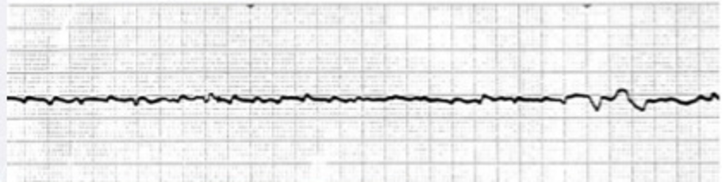
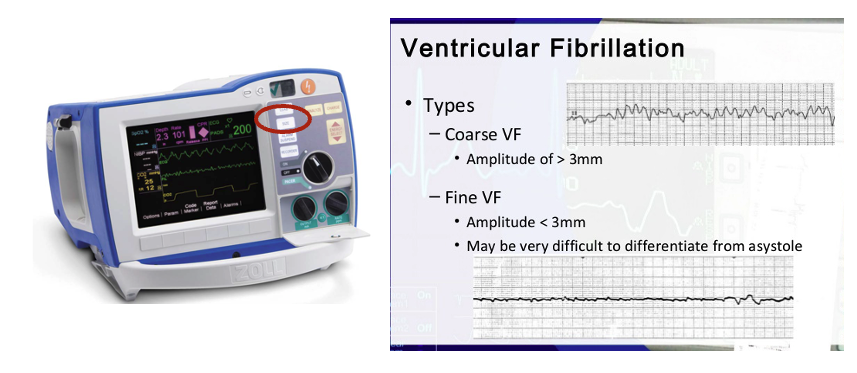
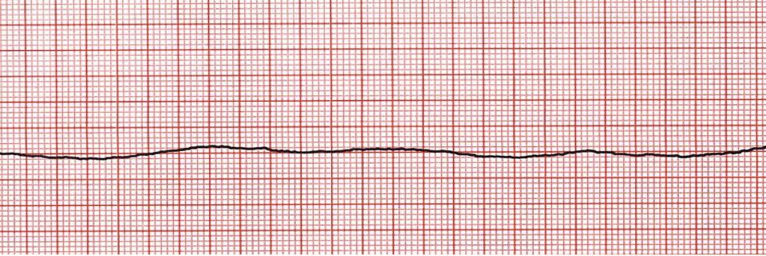
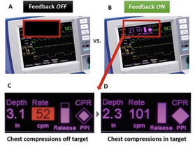
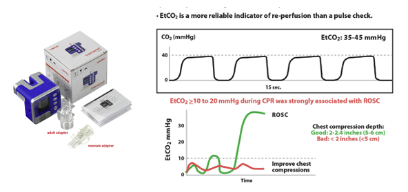
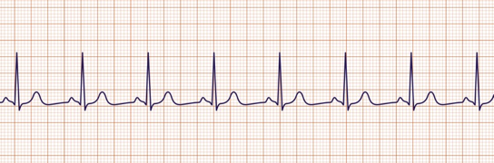

## Pulse Checks in Code Blues

### Learners will practice:

1. Making a shock/no-shock call under uncertainty
2. Preventing airway/procedure pauses
3. Using EtCO2 and other signals when ROSC is uncertain

## Code blue on E50

Compressions are ongoing when you arrive.

You establish yourself as code leader.

**Prompt:** You have 20 seconds before the next pulse check. What are the first things you consider?

## Before the pause

1. Confirm code status.
2. Assign roles: meds, compressor, airway, recorder.

## First pulse check

### No palpable pulse

{fig-alt="Rhythm strip during initial pulse check" width="1200"}

## Fine VF vs asystole

:::: columns
::: {.column width="45%"}
If uncertain:

1. Turn up gain.
2. Check leads/connection.
3. Voice your uncertainty.
4. If it could be VF/pVT, shock (consider consequences of each error).
:::

::: {.column width="55%"}
<figure style="margin: 0;">
  
  <figcaption style="font-size: 0.75em; line-height: 1.15; margin-top: 0.4rem; text-align: center;">Coarse vs fine ventricular fibrillation</figcaption>
</figure>
:::
::::

## Second pulse check

### No palpable pulse

CPR has resumed until the second pulse check. There is no palpable pulse and this rhythm:

{fig-alt="Second pulse check with airway team asking for time"}

**Prompt:** What is the rhythm now, and what do you do about the airway request?

## Airway answer

**Answer:**

> "Airway, keep working during compressions. We'll give you the next planned pause only if you are ready."

> "If intubation will interrupt CPR, put in an LMA."

Airway does not own the pause.

## What really matters

During arrest, protect two things:

1. **Compression fraction**
2. **Early defibrillation for shockable rhythm**

Everything else has to fit around those.

{fig-alt="Zoll feedback mode" fig-align="center" width="400"}

## Confirming ROSC can be hard

Use:

1. EtCO2 trend or sudden rise
2. Arterial line if present
3. SpO2 pleth waveform if present
4. Doppler if ready
5. POCUS only if pre-positioned

When in doubt, continue compressions.

## Do not forget EtCO2

{fig-alt="EtCO2 waveform and values during resuscitation" width="620"}

Use EtCO2 to monitor CPR quality, shock-type, and ROSC.

## Third pulse check

{fig-alt="EtCO2 rising to 36 mmHg" width="1200"}

> "Possible ROSC. At the next check: rhythm, pulse, waveform. If not convincing, resume compressions."

## Think out loud

Try:

- Do not forget EtCO2.
- If unclear, resume compressions.

## Summary

**Confirm code status.**

**Do not miss fine VF.**

**Do not prolong pauses for procedures.**

**Use EtCO2 to monitor compressions and help detect ROSC.**

[Return to Modules Page](../modules.html "Modules Page")
